**Виконав:** 

*студент 2-го курсу, групи ІМ-23* **Михайло Іванніков ivannikovmihail96@gmail.com tg:@Mihail_Ivannikov**  

[НТУУ "КИЇВСЬКИЙ ПОЛІТЕХНІЧНИЙ ІНСТИТУТ імені ІГОРЯ СІКОРСЬКОГО](https://kpi.ua/)

[Факультет інформатики та обчислювальної техніки](https://fiot.kpi.ua/)

[Кафедра обчислювальної техніки](https://comsys.kpi.ua/)

# Опис проекту:

Ця система дозволяє створювати, читати, оновлювати та видаляти дані з бази даних SQL за допомогою HTTP-запитів. Я використав Node.js як серверну платформу та розробив Restful сервіс для надання зручного інтерфейсу для взаємодії зі збереженими даними.

# Тестування працездатності системи

### Сервер:

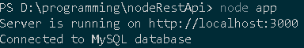

## Реалізація CRUD:

### POST /users:

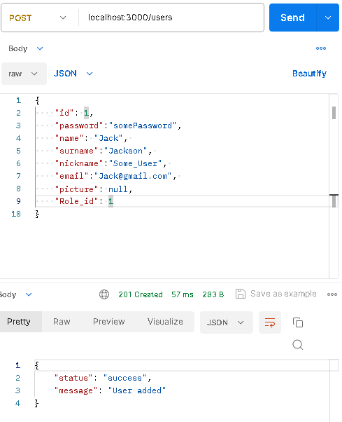

### GET /users:

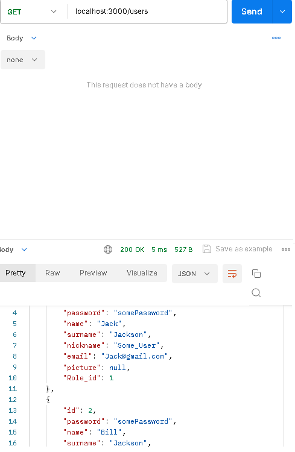

### PUT /users:

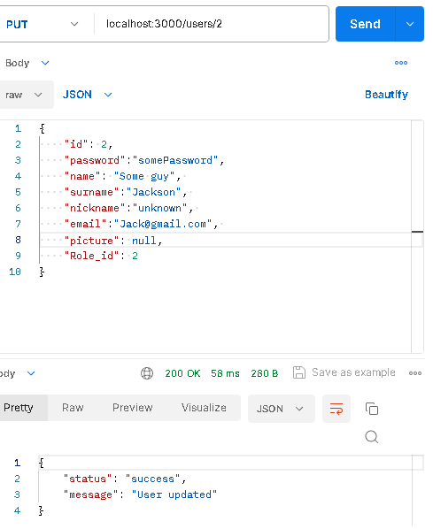

### GET /users/:id

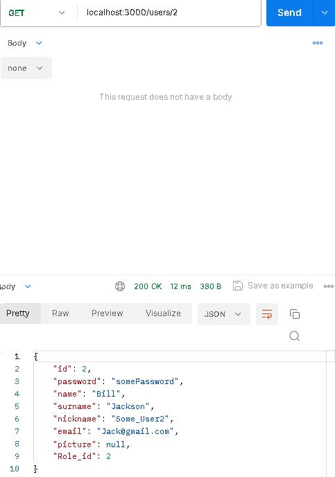

### DELETE /users/:id

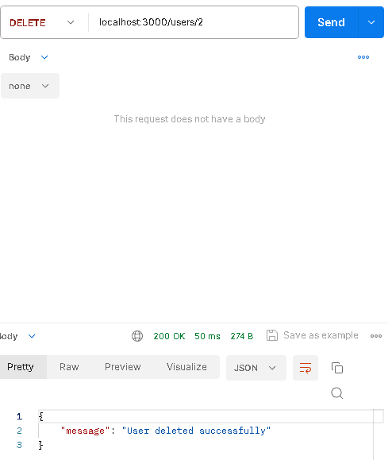

### POST /quiz:

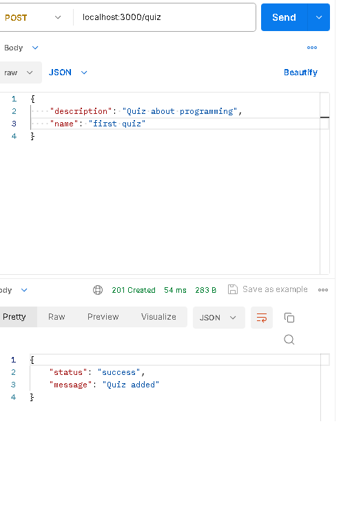

### GET /quiz:

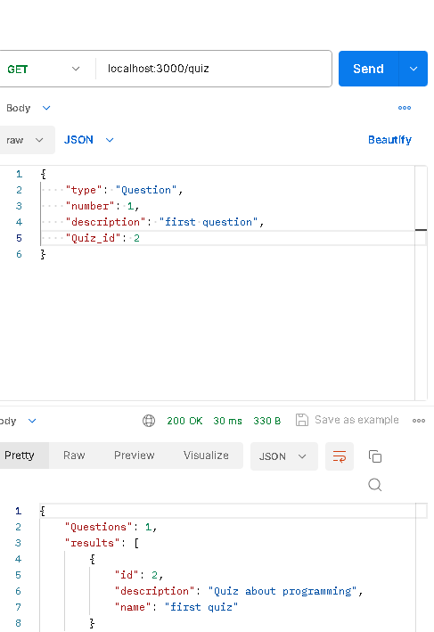

### PUT /quiz:

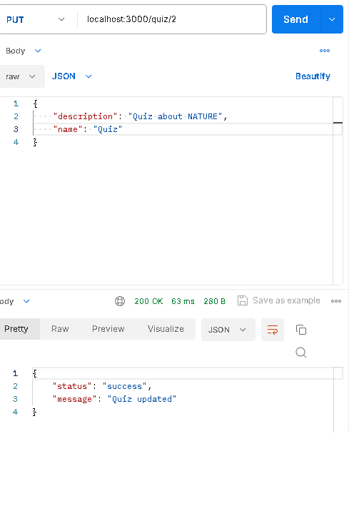

### DELETE /quiz/:id

### POST /questions:

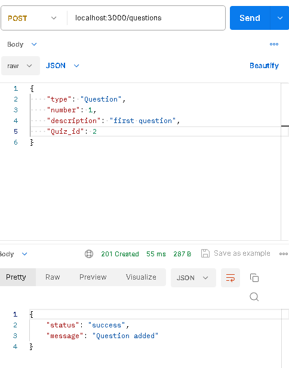

### PUT /questions:

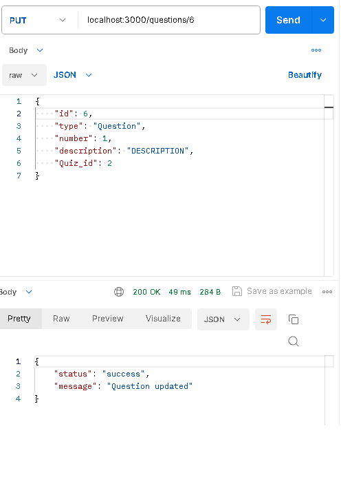

### DELETE /questions/:id

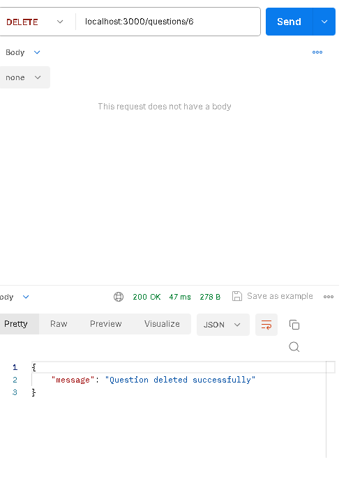
